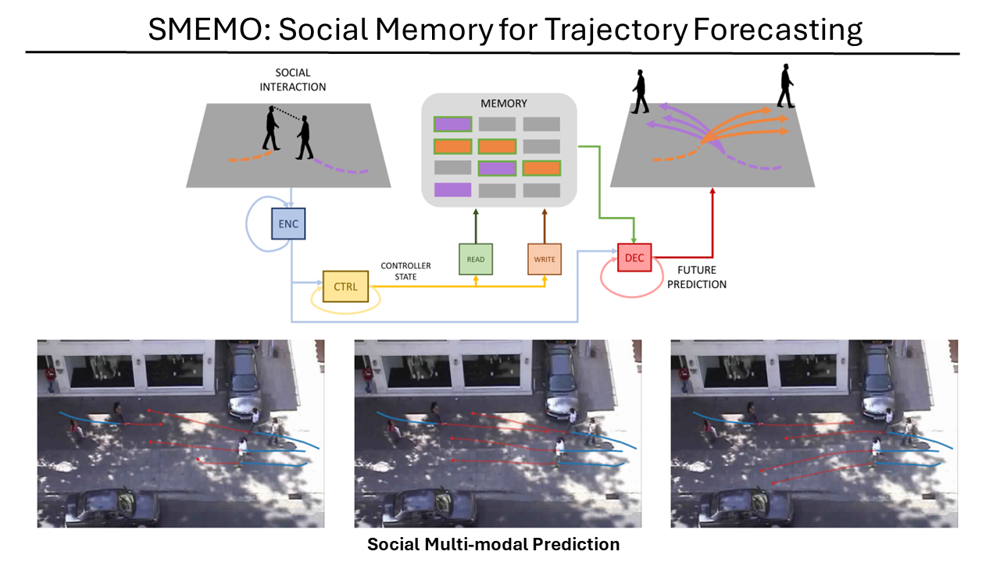

# Smemo: Social memory for trajectory forecasting
Official Pytorch code for Smemo: Social memory for trajectory forecasting (PAMI 2024).
Francesco Marchetti, Federico Becattini, Lorenzo Seidenari, Alberto Del Bimbo.

Paper (arxiv version): https://arxiv.org/abs/2203.12446




## Installation
To install the required packages, create a conda environment using this command: 
```bash
conda env create -f env.yml
```

Pytorch installation:
Then you can install PyTorch 1.9.0 required in this repo:
```bash
pip install torch-scatter -f https://data.pyg.org/whl/torch-1.9.0+111.html
```
(it is propable that other versions of PyTorch are fine but the training and testing were carried out with that version of PyTorch)

It's required to install the torch-scatter library, used to optimize reading and writing in Social Memory.
```bash
pip install torch-scatter==2.0.8  -f https://data.pyg.org/whl/torch-1.9.0+111.html
```

## Train the Model
To train a model by scratch, utilize the script train_*.py, where you specify which dataset you want to train on

For example, in SSA, use this command:
```bash
python train_ssa.py
```

(work in progress for eth/ucy and SSD)

## Test the Model
In a pretrained folder, there are the pretrained weights of the models in the various datasets.

To test the model on the SSA dataset, use this command:
```bash
python test_ssa.py
```

In eth/ucy benchmark, you can choose the dataset:

```bash
python test_eth.py --test {eth,hotel,univ,zara1,zara2}
```


## Acknowledgment
This work was supported by European Commission under European Horizon 2020 Programme, under Grant 951911 - AI4Media.
